# 2BHK Interior — Ahilyanagar (2D + 3D)

An interactive 2D floor plan and 3D model of a typical 1st to 3rd floor 2BHK in Ahilyanagar, Maharashtra. The style is **lighter modern**, planned for a family with one child, with an interiors budget of **₹8–10 lakh**.

`CLAUDE_CODE_BRIEF.md` is the single source of truth. The source drawing is `docs/floor-plan-source.jpg`.

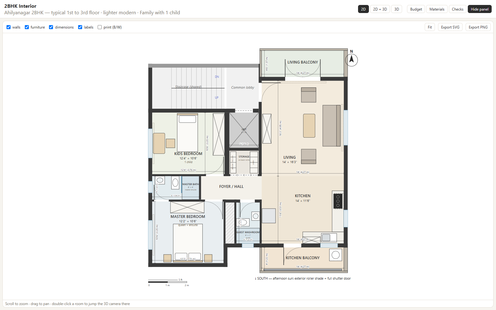

## Run it

```bash
npm install
npm run check        # Phase A boot checks: room areas/dims ±2%, topology, budget band + mapping
npm run dev          # http://localhost:5173
```

Other scripts:

| Command | What it does |
|---|---|
| `npm test` | Vitest: `assertPlanAreas()`, `budgetMeta.inBand()` and every boot check |
| `npm run build` | Type-check and production build |
| `npm run smoke` | Headless Chrome/Edge clicks every camera (all wall modes), layer, panel and export; fails on any page error |
| `npm run screenshots` | Regenerates `docs/screenshots/` (2D plan + 3D views) |
| `npm run immersive` | Walk / Tour / Record end-to-end: saves tour stills, walks with real key presses, records the full tour and checks the video (add `-- --no-record` to skip the ~70 s recording) |

`smoke`, `screenshots` and `immersive` use `puppeteer-core` with your installed Chrome or Edge, so nothing extra is downloaded. Set `CHROME_PATH` if detection fails.

## Controls

- **Header:** switch between `2D`, `2D + 3D` and `3D`, and choose a side panel (`Budget`, `Materials`, `Checks`).
- **2D plan:** scroll to zoom and drag to pan. Toggle the walls, furniture, dimensions and labels layers, and switch to **print (B/W)**. **Fit** resets the view. **Export SVG/PNG** saves the whole plan. Double-click a room to jump the 3D camera there.
- **3D:** drag to orbit, right-drag to pan, scroll to zoom. The camera buttons are Overview, Living, Kitchen, Master, Kids, Foyer / hall and South balcony. **Walls: auto** shows a 1.2 m cutaway (dollhouse view) in the overview and full 10′ walls in room views. You can force either one.
- **Budget panel:** hover a line to highlight the objects it pays for in both the 2D and 3D views.
- **3D mode toggle:** `Orbit` (above) | `Walk` | `Tour` — see [Immersive walkthrough + video](#immersive-walkthrough--video).
- **URL params** (used by the scripts): `?view=2d|3d|split&cam=living&walls=full&panel=none&dims=0&mode=orbit|walk|tour&tourT=12`.

## Immersive walkthrough + video

Brief: `IMMERSIVE_VIDEO_CLAUDE_BRIEF.md`. This builds on the existing scene; the apartment geometry is unchanged.

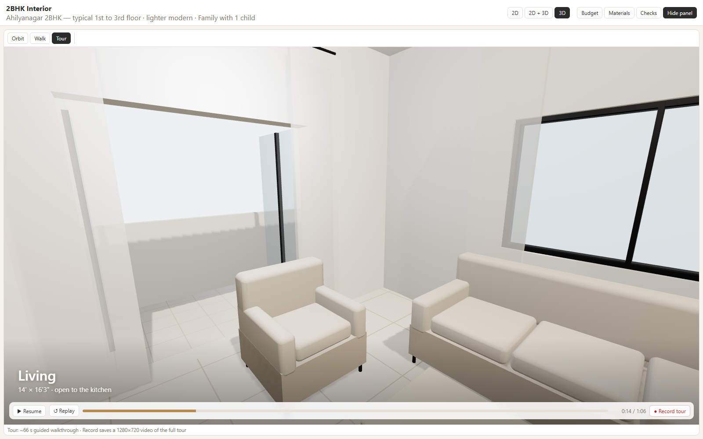

### Walk (first person)

1. In the 3D pane, choose **Walk**. You start in the foyer, facing the living room, at 1.6 m eye height.
2. Click **Click to explore** to lock the mouse, then use:
   - **mouse** to look
   - **W A S D** / arrow keys to move
   - **Shift** to sprint
   - **Esc** to release the mouse
3. You collide with walls, window sills, balcony parapets, the lift core, the closed entry door and storage shutters, and furniture. Collision boxes come from `plan/plan.ts` (`plan/collision.ts`), and you slide along walls instead of sticking. Every internal door and both balcony doors are open and passable, so you can't leave the flat.
4. The room you're standing in shows top-left.

Walk is **desktop-only in v1** (keyboard + mouse). Touch controls are not implemented.

### Tour (cinematic, ~66 s)

Choose **Tour**, and it plays once. The path is:

- 3 s drone establishing shot, then a white fade to eye level
- **Foyer** → **Living** → living balcony
- **Kitchen** → a look out over the **south kitchen balcony** (shade + shutter door; the path never steps onto the slab)
- **Master bedroom** → **Master ensuite** peek
- **Kids room** → back to the living room

Room titles fade in at each stop. Use **Pause / Resume**, **Replay**, or click the progress bar to seek. Waypoints live in `plan/tour.ts` (world XYZ, Y = 1.6). A single pure `tourState(t)` drives the camera, titles, fades and exposure. Tests sample the whole path every 20 ms to confirm it never clips walls, furniture or the lift, and that it stays 45–75 s long.

### Record a video

- **Tour → ● Record tour:** restarts the tour from 0:00, records it, and downloads `ahilyanagar-2bhk-walkthrough.mp4` (or `.webm`) when it ends. **■ Stop (cancel)** discards the recording.
- **Walk → ● Record walk:** records your live session. **■ Stop & save** downloads it.

How the capture works:

- Each frame of the WebGL canvas (`preserveDrawingBuffer`) is copied into a fixed **1280×720** canvas, with the room titles and fades drawn on top. That canvas is recorded with `captureStream(30)` + `MediaRecorder` at 8 Mbps. The titles are drawn into the video itself, because HTML overlays aren't captured.
- While recording, the render pixel ratio is raised so the 3D canvas is at least 1280 px wide, which keeps the capture sharp and the same size whatever your window size is.
- Codec: **H.264 MP4** where `MediaRecorder` supports it (current Chrome/Edge). Otherwise **VP9/VP8 WebM**. **Chrome or Edge work best.** Firefox records WebM. Safari support varies.
- The tour clock follows real time while recording. A slow GPU drops frames rather than producing slow motion.
- Verified headless: one click → 1280×720 H.264 MP4, 65.7 s for the 66.4 s tour, 3.7 MB (`npm run immersive`).

Convert WebM → MP4 (e.g. for WhatsApp) with ffmpeg:

```bash
ffmpeg -i ahilyanagar-2bhk-walkthrough.webm -c:v libx264 -pix_fmt yuv420p walkthrough.mp4
```

### Stills

`docs/screenshots/immersive/` holds `00-tour-intro` through `09-tour-living-end` (one per tour stop) plus `walk-spawn` / `walk-living`.

| | |
|---|---|
| 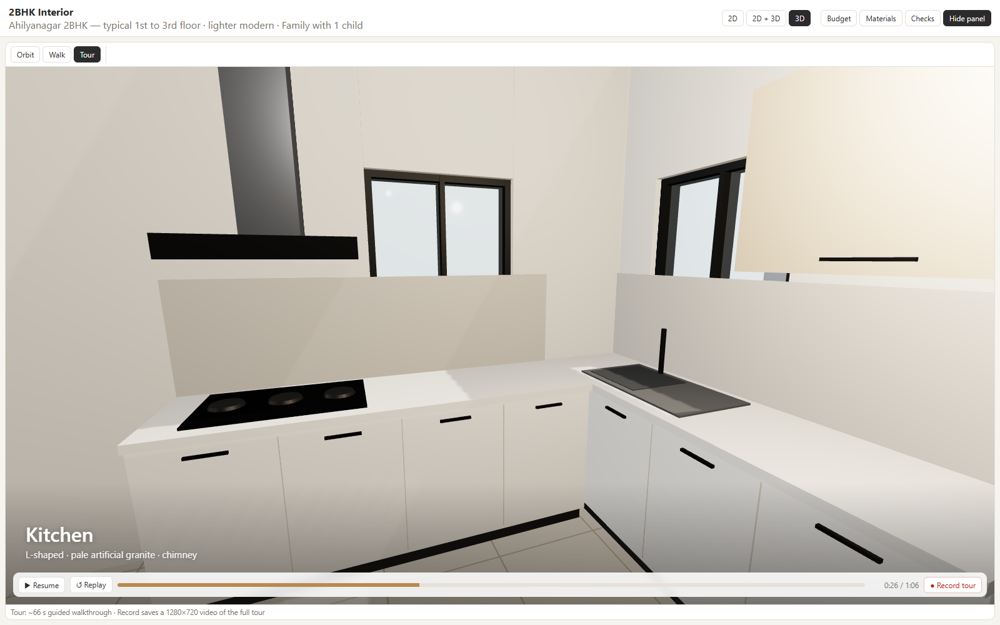 | 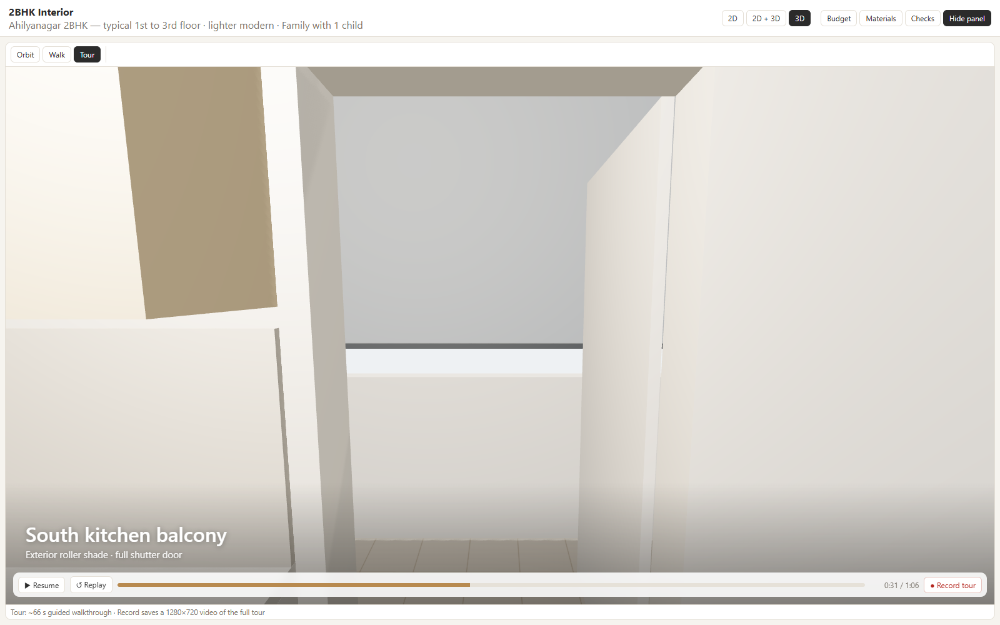 |
| 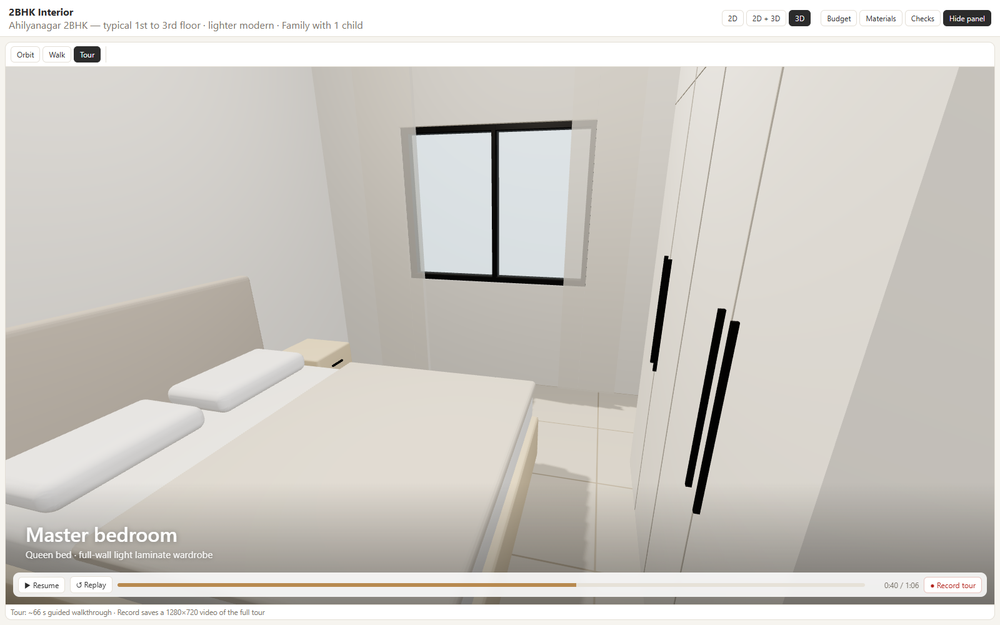 | 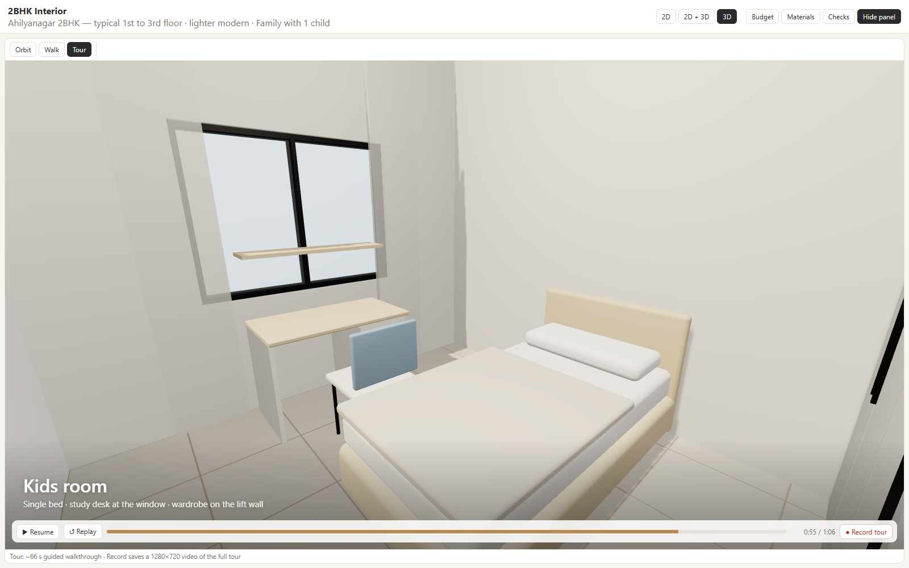 |

### Immersive acceptance checklist

| Item | Status | Evidence |
|---|---|---|
| Mode toggle: Orbit / Walk / Tour | PASS | 3D toolbar; `npm run smoke` switches modes and orbit cameras afterwards with 0 errors |
| Walk: pointer lock, WASD, eye 1.6 m, no wall clipping, doors passable | PASS | `tests/immersive.test.ts` walks foyer→living→kitchen→master→kids through doors and is stopped by walls, entry door, lift, parapet; `npm run immersive` repeats it with real key presses |
| Tour: 45–75 s path hits foyer, living, kitchen, master, kids; titles show | PASS | 66.4 s; stop and title tests; no clipping over 20 ms samples |
| South kitchen balcony acknowledged in tour | PASS | "South kitchen balcony" stop looks out over the slab without walking onto it |
| Record downloads a playable walkthrough video of the tour | PASS | headless run: `.mp4`, 1280×720, 65.7 s, metadata read back by a `<video>` element |
| Existing 2D plan + budget still work | PASS | `npm run check` 30/30, `npm run smoke` (2D layers, exports, budget hover, orbit cameras) |
| README documents controls + ffmpeg convert tip | PASS | this section |

Phase IV extras included: the 3 s establishing shot and an exposure lift at the balcony views. Not done: footsteps, frame-accurate export, and screenshot-strip export.

**Phase 2 (not implemented):** for offline 4K marketing video, evaluate **Remotion + `@remotion/three`** reusing these meshes, with the camera driven by `useCurrentFrame()` instead of R3F `useFrame`. `tourState(t)` is already a pure function of time, so it would map directly onto frame numbers. A WebCodecs/mediabunny frame-accurate encoder is the lighter alternative if realtime capture drops frames on low-end machines.

## How it's built

```
plan/plan.ts        rooms, walls, openings, furniture (meters) + assertPlanAreas()/assertPlanDims()
plan/geometry.ts    wall splitting around openings, ft-in formatting (shared by 2D and 3D)
plan/materials.ts   lighter-modern palette + finish schedule
plan/budget.ts      INR line items + budgetMeta.inBand(); each line lists the model ids it pays for
plan/checks.ts      boot checks used by `npm run check`, vitest and the in-app Checks panel
components/Plan2D.tsx      SVG plan (pan/zoom, layers, dimensions, export)
components/Scene3D.tsx     R3F scene: walls extruded from plan walls/openings, floors, lights, cameras
components/Furniture3D.tsx box-modelled furniture proxies at true proportions
components/BudgetPanel.tsx, Legend.tsx, ChecksPanel.tsx
plan/collision.ts           walk colliders from plan walls/openings/furniture + sliding movement
plan/tour.ts                tour waypoints, walkSpawn, pure tourState(t)
components/WalkControls.tsx    PointerLockControls + WASD + collision
components/TourController.tsx  tour clock → camera
components/VideoRecorder.tsx   1280×720 compositor + MediaRecorder
components/ImmersiveHUD.tsx    lock overlay, titles, tour transport, record controls
src/App.tsx         layout / state
```

**One geometry source.** Both views read `plan/plan.ts`. If you move a room, wall, opening or piece of furniture there, the SVG plan and the 3D scene both update.

**Coordinates.** Units are metres, with `1 ft = 0.3048 m`. The origin is the **SW inside corner of the master bedroom**. +X is east and +Y is north. In 3D, plan `(x, y)` maps to world `(x, height, −y)`. Room rectangles are clear (inside-face) sizes, and walls sit outside them: exterior 200 mm, interior 100 mm, lift shaft 150 mm.

### Layout refinements vs. the stub

Room sizes and roles are exactly as in the stub. The placement was re-fitted to match the source drawing:

- **West stack (south→north):** master, then the 8′×4′ bath, then kids, then the shared stair.
- **Middle strip:** guest bath (south), then the hall, then the storage room (the former basin niche under the lift), then the lift.
- **East wing:** kitchen (south), open to living (north). The balconies are north (living) and south (kitchen).
- **Entry:** from the common lobby (north of the lift) into the living room's NW corner, as drawn.
- **Master ensuite:** the drawing's bath door from the hall is replaced by a door from the master (brief §3.2). The master wardrobe stays on the marked north wall, between the ensuite door and the room door.
- **Kitchen:** the drawing puts the sink and hob on the same leg. The brief requires different legs, so the **sink is on the south leg** under the window and the **hob and chimney are on the east leg**.
- **Remainders:** a 0.46 m plumbing duct fills the gap between the master and the guest bath. The kitchen balcony is modelled at 14′ wide, aligned with the kitchen.

## Budget (default scene)

| Head | ₹ |
|---|---:|
| Modular kitchen (L, pale artificial granite ~₹110/sqft, chimney, sink) | 1,90,000 |
| Wardrobes — master + kids | 1,70,000 |
| Flooring — vitrified dry + anti-skid wet/balconies | 1,10,000 |
| Master ensuite + guest bath | 95,000 |
| Storage room shutters + internals | 30,000 |
| False ceiling + LED lighting | 85,000 |
| Paint (warm off-white) | 55,000 |
| Living furniture — sofa, centre table, TV unit | 1,00,000 |
| Beds, study desk, side tables, mattresses | 75,000 |
| Internal doors / hardware | 40,000 |
| Sheers + light blackout | 25,000 |
| South balcony shade + wash zone + contingency | 25,000 |
| **Total** | **10,00,000** |

`npm run check` confirms three things:

- Every furniture item and non-builder door in the model maps to a budget line.
- Every id a line lists exists in the model.
- The total is inside the band.

Out of band and not modelled: marble, home automation, Italian fittings.

> **Note:** the stub total is **₹10,00,000**, which sits exactly on the upper limit. It passes `inBand()`, but any addition will fail the band check. The balcony/contingency line (₹25k) is also below the brief's ₹40–60k guide. To get back to the brief's ~₹9 L mid-case, trim about ₹50–80k elsewhere, for example kitchen → ₹1.8 L, wardrobes → ₹1.6 L and flooring → ₹1.0 L, and move ₹15k into balcony/contingency. I left the stub amounts unchanged because the brief says to fix stubs only when checks fail.

## Assumptions (brief §8 defaults)

- Flat level: typical 1st–3rd floor. Ceiling height 10′ (3.05 m).
- Kid's age: primary school, so the study desk is 3′6″ × 2′ at the west window.
- Brands: generic mid-market Indian. Entry door, windows and balcony glazing are builder-supplied, so they are not in the budget.
- The fridge appliance is the owner's; the budget covers the fridge housing/loft. The TV set is not modelled.

## Screenshots

| | |
|---|---|
| 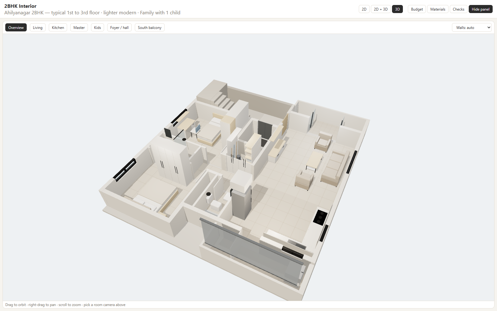 | 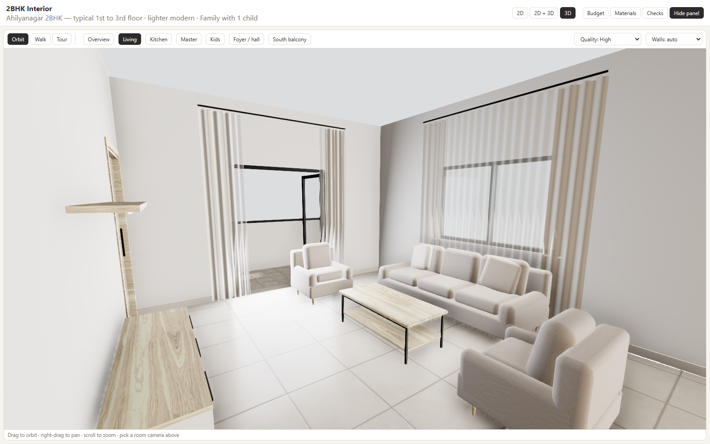 |
| 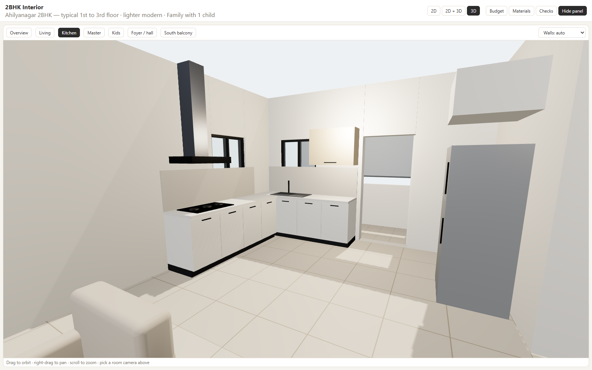 | 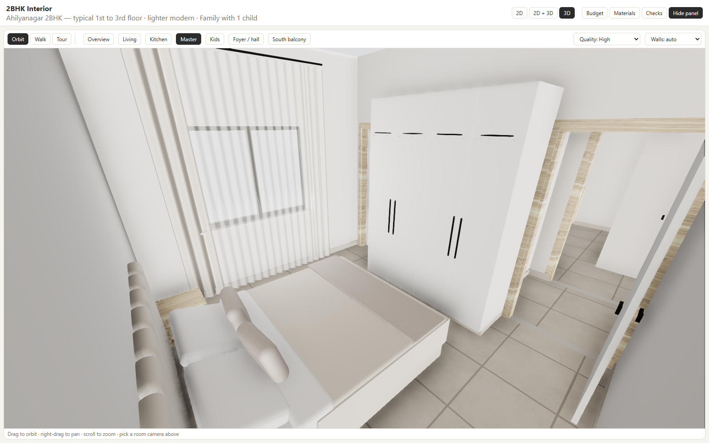 |
| 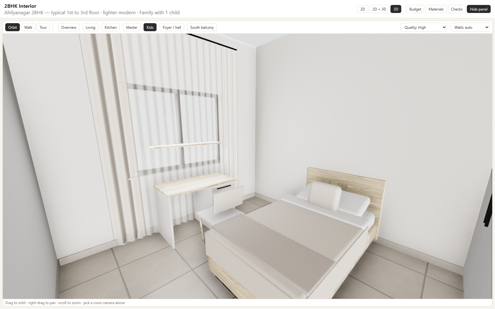 | 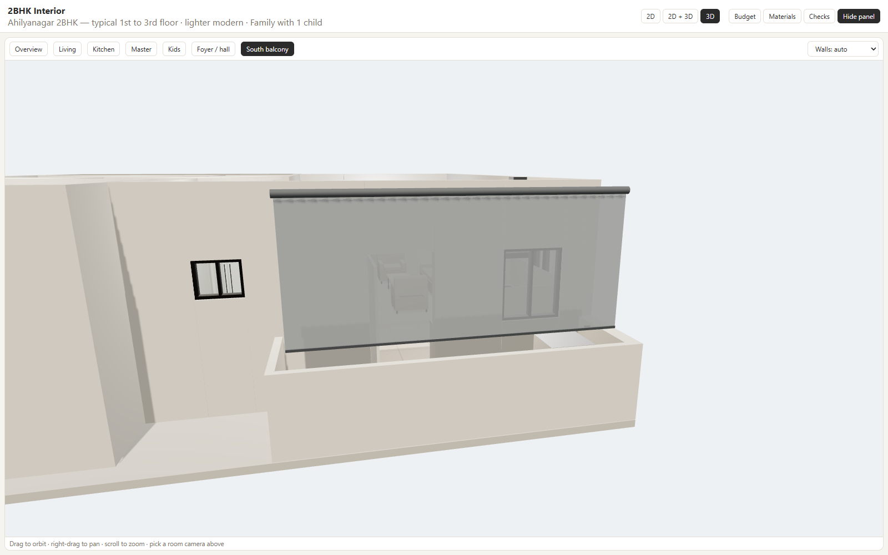 |

The foyer/hall view is at `docs/screenshots/3d-foyer.png` and the full app is at `docs/screenshots/app-split-budget.png`.

## Acceptance checklist (brief §3.3 + §6.5)

| Item | Status | Evidence |
|---|---|---|
| Living 14′×16′3″; kitchen 14′×11′6″ open to living | PASS | `assertPlanDims`, no wall between the two rooms |
| Kids upper 12′4″×10′6″; master lower 12′2″×10′6″ | PASS | dims + "kids north of master" check |
| Master ensuite 8′×4′ (door from master); guest bath 4′×7′; storage at ex-basin niche | PASS | dims + topology checks; storage has no basin |
| Living balcony 4′6″; kitchen balcony 4′ south; lift 5′×6′ shown | PASS | dims + `facing: "south"` |
| Door swings roughly match plan logic | PASS | 2D arcs, 3D leaves open along the same swing |
| 2D and 3D share `plan.ts` | PASS | both import `plan/plan.ts`; walls split by the shared `plan/geometry.ts` |
| Lighter modern + pale artificial granite L + south balcony shade/shutter door | PASS | materials check, 3D views |
| Budget total ∈ ₹8–10 L and lines match visible scope | PASS | `inBand()` true (₹10,00,000, at the upper limit); mapping check |
| App runs locally; room camera switch does not crash | PASS | `npm run smoke` (every camera in 3 wall modes, 0 page errors) |

Out of scope: structural changes to the lift or stair, municipal working drawings, photoreal exterior, VR, live vendor pricing.
